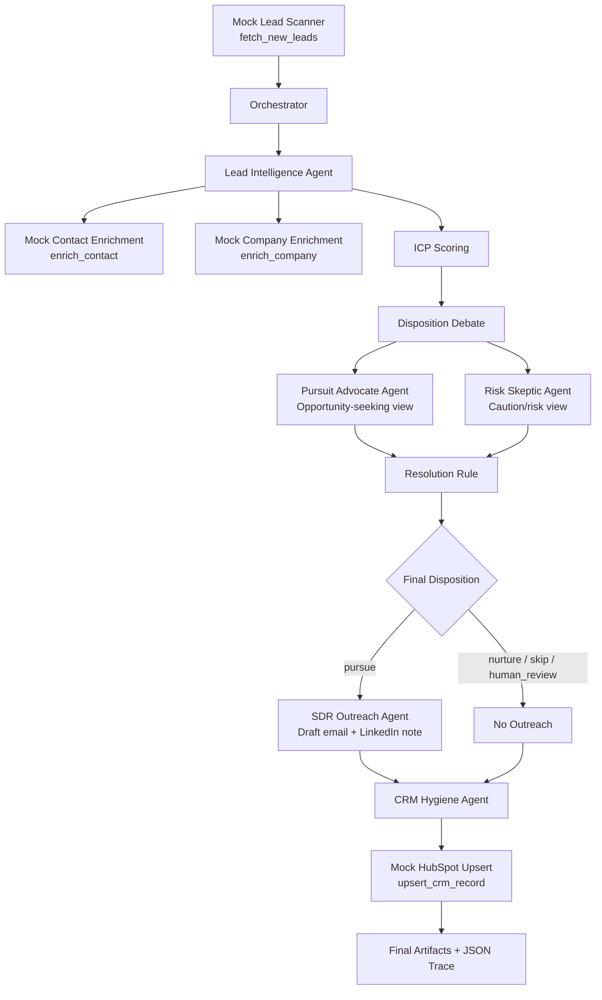

# Sircles Agentic Lead Workflow

Technical take-home implementation for the Sircles AI Agentic Engineer Internship.

This project implements a small, deterministic team of AI-style agents that handles an inbound-lead-to-first-touch workflow for a marketing agency. The focus is not just automation, but judgment: which leads are worth pursuing, how confident the system is, and when a human should step in. No real APIs or API keys are used. External tools are mocked from local fixtures, and LLM behavior is represented through a deterministic `MockLLMClient` so the project remains reproducible without credentials.

The workflow follows the required sequence:

```text
intake → enrich → debate disposition → resolve & record → outreach if pursue → CRM → artifacts + trace
```

---

## Submission checklist

Required deliverables covered:

* Source code runnable from the README
* Mock tools for lead scanning, enrichment, and CRM upsert
* Four sample leads covering pursue, skip, nurture, and ambiguous human-review cases
* Architecture diagram showing agents, debate, orchestrator, and handoffs
* Debate-first mechanism before outreach
* Recorded dissent and escalation path
* JSON run traces for a clear pursue case and an ambiguous competitor case
* Tests for the resolution rule, agent contracts, outreach safety, CRM behavior, orchestrator, CLI, and mock LLM interface
* One-page design note in `design_note.md`

---

## What this system does

The system receives mocked inbound leads, enriches each lead with mocked contact and company data, scores the lead against a transparent ICP rubric, forces a debate before outreach, resolves the debate with an explicit rule, drafts outreach only for approved pursue leads, and writes a structured mock CRM record.

The system outputs:

* final disposition: `pursue`, `nurture`, `skip`, or `human_review`
* debate positions from two competing agents
* resolution rationale
* recorded dissent
* outreach draft when allowed
* CRM record
* JSON run trace

---

## LLM usage

The project includes a lightweight LLM interface in `src/sircles_agents/llm.py`.

By default, agents use `MockLLMClient`, which returns deterministic fallback responses. This satisfies the no-keys requirement while making the LLM boundary explicit. In production, this interface could be replaced with OpenAI, Anthropic, Gemini, a local model, or another provider using environment variables for credentials.

The mock LLM is used by:

* the Pursuit Advocate Agent to produce its debate thesis
* the Risk Skeptic Agent to produce its debate thesis
* the SDR Outreach Agent to produce the email subject, email body, and LinkedIn note

The decision logic remains deterministic and testable.

---

## Architecture



---

## Agents

### Lead Intelligence Agent

Responsible for:

* enriching the raw lead
* scoring the lead against the ICP
* proposing an initial disposition
* producing positive evidence, negative evidence, and uncertainty notes

This agent does not make the final decision. Its output is challenged by the debate mechanism.

### Pursuit Advocate Agent

Argues the opportunity case. It focuses on the cost of false skips, where the agency might miss a lead that could become a multi-month retainer.

### Risk Skeptic Agent

Argues the caution case. It focuses on false pursues, including wasted SDR time, reputational damage, bad-fit outreach, and competitor risk.

### SDR Outreach Agent

Drafts a personalized first-touch email and LinkedIn note only when the resolved disposition is `pursue`.

It refuses to run for `nurture`, `skip`, or `human_review`.

### CRM Hygiene Agent

Creates a structured mock HubSpot-style CRM record with:

* disposition
* deal stage
* score
* confidence
* human-review flag
* resolution rationale
* recorded dissent
* outreach artifact when available

### Orchestrator

The team lead. It owns the shared workflow state, runs the sequence, triggers debate, applies the resolution rule, routes handoffs, and writes the final trace.

---

## Debate-first mechanism

Before any outreach is drafted, the system requires a debate between at least two agents.

The debate includes:

1. **Competing positions**
   The Pursuit Advocate and Risk Skeptic intentionally optimize for different risks.

2. **Stated confidence**
   Each position includes a recommendation, confidence score, thesis, evidence, and risk notes.

3. **Resolution rule**
   The orchestrator applies deterministic arbitration with hard risk vetoes.

4. **Recorded dissent**
   Losing positions are preserved in the final resolution and CRM notes.

5. **Escalation path**
   Competitor risk, low confidence, or unresolved risk can trigger `human_review`.

Resolution rule summary:

```text
Confidence-weighted arbitration with hard risk vetoes:
- competitor/conflict risk escalates to human review
- low confidence escalates to human review
- high-score, high-confidence, low-risk leads can be pursued
- clear poor-fit leads are skipped
- moderate-fit leads are nurtured
```

---

## Lead scoring

The Lead Intelligence Agent scores leads out of 100 using a transparent rubric:

| Signal                      | Max Points |
| --------------------------- | ---------: |
| Industry fit                |         25 |
| Company size / budget proxy |         20 |
| Growth signal               |         15 |
| Buyer fit                   |         20 |
| Pain signal                 |         20 |
| Risk penalty                |    -30 max |

Disposition guidance:

| Condition                             | Proposed disposition |
| ------------------------------------- | -------------------- |
| High score, high confidence, low risk | `pursue`             |
| Moderate score, some uncertainty      | `nurture`            |
| Low score, clear poor fit             | `skip`               |
| Competitor risk or low confidence     | `human_review`       |

---

## Sample leads

The fixture includes four mocked leads:

| Lead ID                     | Scenario                                      | Expected behavior |
| --------------------------- | --------------------------------------------- | ----------------- |
| `lead_saas_pursue`          | Growth-stage B2B SaaS VP of Growth            | Clear pursue      |
| `lead_student_skip`         | Student asking for free advice                | Clear skip        |
| `lead_ecommerce_nurture`    | E-commerce founder with unclear budget/timing | Nurture           |
| `lead_competitor_ambiguous` | Competing marketing agency founder            | Human review      |

---

## Setup

Requires Python 3.10+.

Create and activate a virtual environment:

```bash
python3 -m venv .venv
source .venv/bin/activate
```

Install dependencies:

```bash
pip install -e ".[dev]"
```

---

## Run the project

List available leads:

```bash
python -m sircles_agents.main list-leads
```

Run one lead:

```bash
python -m sircles_agents.main run lead_saas_pursue --show-trace
```

Run the ambiguous competitor case:

```bash
python -m sircles_agents.main run lead_competitor_ambiguous --show-trace
```

Run all leads:

```bash
python -m sircles_agents.main run-all
```

The commands above write JSON traces to:

```text
traces/
```

---

## Expected results

| Lead ID                     | Final disposition | Outreach | CRM stage      | Human review |
| --------------------------- | ----------------- | -------- | -------------- | ------------ |
| `lead_saas_pursue`          | `pursue`          | yes      | `qualified`    | no           |
| `lead_student_skip`         | `skip`            | no       | `disqualified` | no           |
| `lead_ecommerce_nurture`    | `nurture`         | no       | `nurture`      | no           |
| `lead_competitor_ambiguous` | `human_review`    | no       | `human_review` | yes          |

---

## Run traces

The CLI writes full JSON traces for reviewer inspection.

Useful commands:

```bash
python -m sircles_agents.main run lead_saas_pursue --show-trace
python -m sircles_agents.main run lead_competitor_ambiguous --show-trace
```

These create:

```text
traces/lead_saas_pursue_trace.json
traces/lead_competitor_ambiguous_trace.json
```

These two traces cover:

* a clear happy-path pursue case
* an ambiguous competitor case that triggers debate and human review

---

## Tests

Run:

```bash
python -m pytest
```

Current coverage includes:

* Lead Intelligence Agent contract
* scoring/disposition behavior through agent tests
* debate resolution rule
* recorded dissent
* human-review escalation
* outreach safety
* CRM hygiene behavior
* orchestrator full flow
* CLI smoke tests
* mock LLM behavior

Expected result after the mock LLM layer is added:

```text
19 passed
```

---

## Notes on implementation choices

This project intentionally uses deterministic mocked enrichment tools and a deterministic mock LLM client rather than live external services. That keeps the submission runnable without API keys, easy to test, and easy to defend. The architecture is still agentic: agents have separate responsibilities, structured handoffs, competing recommendations, an explicit LLM boundary, and an orchestrator that resolves disagreement before consequential action.

A real deployment could replace the deterministic scoring, mocked enrichment, CRM stub, and mock LLM with production providers while keeping the same contracts, tests, and orchestration boundaries.
